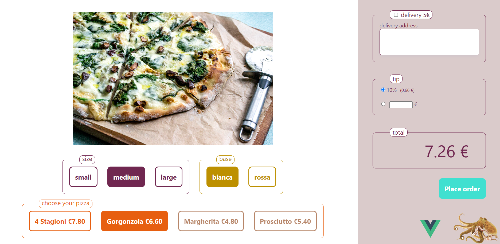
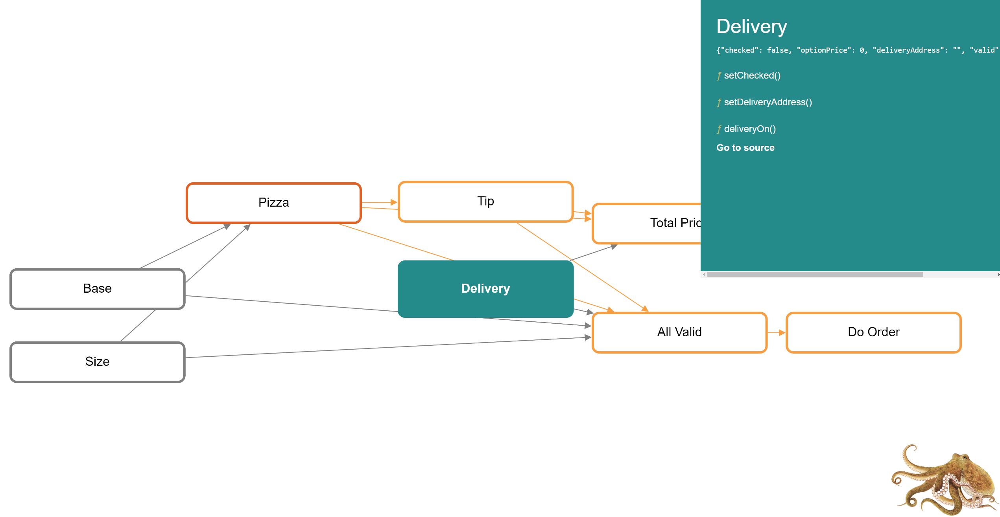

# Octopus State Graph

### Modelling your UI as a directed acyclic graph.

## Get started
```
git clone https://github.com/bbsimonbb/octopus-turbo.git
cd octopus-turbo
npm install -g pnpm
pnpm install
pnpm run dev
```



## What am I looking at here?

Directed acyclic graphs are muched discussed in comp-sci, but octopus appears to be the first reusable, turnkey, ready-to-wear, off-the-shelf implementation of a DAG for application development, in any language, that I'm aware of.

This is remarkable because DAGs hit a sweet spot in the middle of the three common programming paradigms (OO, event-driven, functional). Let's have a DAG as the top-level structure of our applications. Data-fetching and onChange handlers live in DAG nodes, next to the data they act on. The UI flows out from the DAG with fine-grained reactivity. Our app state is effortlessly consistent, because any outside change (user action, api result) unleashes a graph traversal. Our UI components become much simpler, because they just need to dumbly reflect values in the graph.

In the apps folder, there are two versions of the same sample UI, one with React, one with Vue. Click around. Simple on the surface, there are a lot of rules to implement...

- Total price sums pizza, delivery and tip. The value of tip may depend on the value of pizza
- Any of the five user controls can invalidate the order.
- The state of the (orange) pizza control depends on user input, the size chosen and the base chosen.
- Warnings only show if you've interacted with a control, or if you've tried to submit.
- Warnings only show if preconditions are met. Why bully you to choose a pizza when you haven't chosen a base yet?

Like many (all?) UI's, this UI is a directed acyclic graph. It could be modelled as an object-oriented system, or an event-driven one, or with a functional paradigm, but it _intrinsically is_ a directed acyclic graph, because this is the loosest possible structure that doesn't admit infinite loops. The order of controls on screen is usually a good approximation of the structure of the graph, but of course in a UI the user can interact with controls in any order. How are we going to ensure that the state is always consistent? Let's see what happens when we make the graph structure explicit...




This graph, generated by octopus-state-graph, visualized with octopus devtools, shows you the structure and state of your running application. Essentially, each user control on screen is underpinned by a node in the graph.

A node has a name, a value (`val`), `methods` and a recalculate function (called `reup()` because it's shorter and I'm a huge Wire fan.) `reup()` _can reference any other node by name in its argument list._ This is all we need to build the graph. The `methods` property contains all the methods that will modify `val`. (This is your responsibility. Only a node's own `reup()` and `methods` should modify its `val`.) 

Octopus' role is simple: Firstly, on `build()`, it builds the graph based on the call signatures of all the `reup()` functions, checking that the requested dependencies exist, and that no cycles are created. 

Secondly, octopus ensures that when a node's `val` changes (when a method returns), the graph will be traversed, and all the `reup()` functions starting with that of the changed node, will be called sequentially. (The sequence is determined by the topological sort of the graph.) As such, for any given external change, a node only recalculates if it is downstream of the change, and it only reacalculates once, after it's predecessors have updated.

(There is a ton of scope for optimising traversals. Methods could report if they made a change, or we could detect this. Nodes would then be reupped only if necessary. Going further, a tricky implementation with promises could let different branches of a traversal proceed independently, such that a slow node only delayed downstream branches that depend on it. Stay tuned!)

Nodes can fetch data.  In many situations, it will make much more sense to fetch your data into this persistent, reactive structure, rather than fetching from your UI components that come and go as the user navigates. Unlike a reducer, a graph traversal will happily wait while a network call completes, and downstream nodes will then recalculate taking account of the fresh context. Alternatively, a node can launch a network request and return immediately. Antecedent nodes might go into a waiting state, which you can use to control spinners etc. Then when the fetch returns, a node method handles the return and a new traversal is initiated, clearing the spinners and displaying the fresh data and any cascading effects.

So now the picture emerges. Your nodes lie at the intersection of your system and the outside world. Like in OO, they encapsulate a bit of state, and the methods that modify it. Like event-driven systems, they react to upstream changes and their responsibility ends when they publish their value. There's a hat-tip to functional programming and one-way data flow in the notion of a traversal, but this approach is intentionally much less dogmatic. State, both private and published, can accumulate in nodes, and `reup()` functions can be async and impure. And we get to mutualise, in the `reup()` function, the magic sauce that combines some user input with the current state of the system to produce the node's current value, a value to which downstream nodes can then react. All this is done with no funny business. Your `val` is not proxied, there's no expensive change detection and very limited passing around of functions. There are no new concepts. Node code is biblically simple.

<!-- Graph-oriented applications, let's call them, have an emergent structure, that we can visualise, and that we can use to optimise traversals and eliminate unnecessary recalculations. When we've added all our nodes, we call build() on the graph. Octopus constructs our graph, checking that there are no cycles, and producing a sequence for traversing, a topological sort. This structure can then be visualised in Octopus devtools. The visualisation reads from left to right, with sources on the left, and sinks on the right. Hovering over a node highlights its predecessors and antecedents. When we interact with our app, we can see in the graph which node has received our user input. Clicking a node in the devtools opens the details pane, displaying the node's current published value and methods, and we can go directly from here to the node source. This makes it very easy to reason about, as they say, the structure and behaviour of our application. -->

A super possibility of octopus is reporting nodes. A reporting node chooses its predecessors not by name, but with a filter function. Look at the [totalPrice](./apps/octopus-pizza/src/graph/totalPrice.ts) and [allValid](./apps/octopus-pizza/src/graph/allValid.ts) nodes in the sample applications to see how this is done. Any new node whose published `val` contains a price will automatically contribute to the total.

<!-- A further possibility is node wrapping. A node wrapper is just a function called after `reup()`, giving you a second chance to modify `val`. In this way, you can handle cross-cutting concerns without having to intervene in the code of the wrapped nodes. Call wrapNode() anytime before build, even before the node itself is added. You will be warned at build time if you've tried to wrap a node that doesn't exist. -->

The last thing to cover is serialisation. In complex applications, you may want to be able to save and reload your graphs. To do this, we should distinguish between hot and cold state. Hot state is the full picture, presented to the UI layer. In this pizza example, the full list of option values (present in the hot state) comes from the source code, so there's no need to duplicate it into the cold state. The cold state will just need to include the user's choices among the options. The total price is trivially calculated so again there's no need to save it. So to save our graph, we just need to implement `saveState()` and `loadState()` on our options. When we call `graph.saveState()`, we get a little object containing just the saved user input, together with two properties that allow us to efficiently rehydrate the graph without needing to rebuild.

## Simplest possible example
See [the tests](./packages/octopus-state-graph/src/__tests__/graph.test.mts) for working simple examples. Essentially you need to...

```
const graph = createGraph()
graph.addNode("nodeName", aNode)
...
if(/* you're starting afresh */)
    graph.build()
else
    graph.loadState( JSON.parse(savedState) )

// your UI is live, then when you're finished...

const savedState = JSON.stringify(graph.saveState())
```
## Integration with front-end frameworks
To integrate with a front-end framework, we just need the framework to observe `val`. In Vue, this is easily accomplished by wrapping `val` in `reactive()`. For react we need to grab mobx, and wrap `val` in `observable()`, and our react components with `observer()`. Additionally, mobx likes you to tag state-modifying functions as actions, so that all actions can complete before the DOM is modified. You should do this at the outermost level, wrapping your handlers with `action()` in your react components. You should also wrap any callbacks you create inside `reup()` and `methods`. All this is demonstrated in the React sample.

## devtools
DO NOT MISS the devtools extension (screenshot above). You can visualise the graph of your UI, see in real time what nodes you're interacting with, what value they publish, and navigate directly to the source. Click the octopus to bring up devtools in a popup. It's not in the Chrome store yet, so to install it you'll need to download and build [the project](https://github.com/bbsimonbb/octopus-devtools), then Extensions => Pack extension


