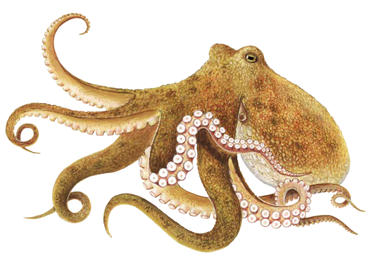

# Octopus State Graph

### Modelling your UI as a directed acyclic graph.

## pnpm
```
pnpm install
turbo dev
```

## What am I looking at here?
Not totally sure myself, but...

Most computer programs, and all user interfaces, are directed acyclic graphs. They can be modelled as object-oriented systems, or event-driven ones, or with a functional paradigm, but they intrinsically are directed acyclic graphs, because this is the loosest possible structure that doesn't admit infinite loops. So let's see what happens when we make this structure explicit.

**Octopus state graph** constructs a graph out of your nodes. A node has a value (`val`), `methods` and a recalculate function, called `reup()` because it's shorter and I'm a huge Wire fan. `reup()` _can reference any other node by name in its argument list._ The `methods` property contains all the methods that will modify `val`. (This is your responsibility. Only `reup()` and `methods` should modify a node's `val`.) 

Octopus' role is simple: Firstly it checks that your graph is acyclic. Secondly, it ensures that when a node's `val` changes (when a method returns), the graph will be traversed, and all the `reup()` functions, starting with that of the changed node, will be called sequentially. (The sequence is determined by the topological sort of the graph.)

Nodes can fetch data.  In many situations, it will make much more sense to fetch your data into this persistent, reactive structure, rather than fetching from your UI components that come and go as the user navigates. Unlike a reducer, a graph traversal will happily wait while a network call completes, and downstream nodes will then recalculate taking account of the fresh context. Alternatively, a node can launch a network request and return immediately. Antecedent nodes might go into a waiting state, which you can use to control spinners etc. Then when the fetch returns, a node method handles the return and a new traversal is initiated, clearing the spinners and displaying the fresh data and any cascading effects.

So now the picture emerges. Your nodes lie at the intersection of your system and the outside world. Like in OO, they encapsulate a bit of state, and the methods that modify it. Like event-driven systems, they react to upstream changes and their responsibility ends when they publish their value. There's a hat-tip to functional programming and one-way data flow in the notion of a traversal, but this approach is intentionally much less dogmatic. State can accumulate in nodes, and `reup()` functions can be async and impure. And we get to mutualise, in the `reup()` function, the magic sauce that combines some user input with the current state of the system to produce the node's current value, a value to which downstream nodes can then react. All this is done with no funny business. Your `val` is not proxied, there's no expensive change detection and very limited passing around of functions. There are no new concepts. Node code is biblically simple.

<!-- Graph-oriented applications, let's call them, have an emergent structure, that we can visualise, and that we can use to optimise traversals and eliminate unnecessary recalculations. When we've added all our nodes, we call build() on the graph. Octopus constructs our graph, checking that there are no cycles, and producing a sequence for traversing, a topological sort. This structure can then be visualised in Octopus devtools. The visualisation reads from left to right, with sources on the left, and sinks on the right. Hovering over a node highlights its predecessors and antecedents. When we interact with our app, we can see in the graph which node has received our user input. Clicking a node in the devtools opens the details pane, displaying the node's current published value and methods, and we can go directly from here to the node source. This makes it very easy to reason about, as they say, the structure and behaviour of our application. -->

A super possibility of graphs is reporting nodes. A reporting node chooses its inputs not by name, but with a filter function. Look at the totalPrice and allValid nodes in the sample applications to see how this is done.

<!-- A further possibility is node wrapping. A node wrapper is just a function called after `reup()`, giving you a second chance to modify `val`. In this way, you can handle cross-cutting concerns without having to intervene in the code of the wrapped nodes. Call wrapNode() anytime before build, even before the node itself is added. You will be warned at build time if you've tried to wrap a node that doesn't exist. -->

The last thing to cover is serialisation. In complex applications, you may want to be able to save and reload your graphs. To do this, we should distinguish between hot and cold state. Hot state is the full picture, presented to the UI layer. In this pizza example, the full list of option values lives in the code, so there's no need to duplicate it into the cold state. The cold state will just need to include the user's choices among the options. The total price is trivially calculated so again there's no need to save it. So to save our graph, we just need to implement saveState() and loadState() on our options. When we call graph.saveState(), we get a little object containing just the saved user input, together with two properties that allow us to efficiently rehydrate the graph without needing to rebuild.

## Integration with front-end frameworks
To integrate with a front-end framework, we just need the framework to observe `val`. In Vue, this is easily accomplished by wrapping `val` in `reactive()`. For react we need to grab mobx, and wrap `val` in `observable`, and our react components with `observer`. Additionally, mobx likes you to tag state-modifying functions as actions, so that all actions can complete before the DOM is modified. You should do this at the outermost level, wrapping in your handlers with `action()` in your react components. You should also wrap any callbacks you create inside `reup()` and `methods`.

## devtools
DO NOT MISS the devtools extension. You can visualise the graph of your UI, see in real time what nodes your interacting with, what value they publish, and navigate directly to the source. It's not in the Chrome store yet, so you'll need to download and build [the project](https://github.com/bbsimonbb/octopus-devtools), then Extensions => Pack extension


